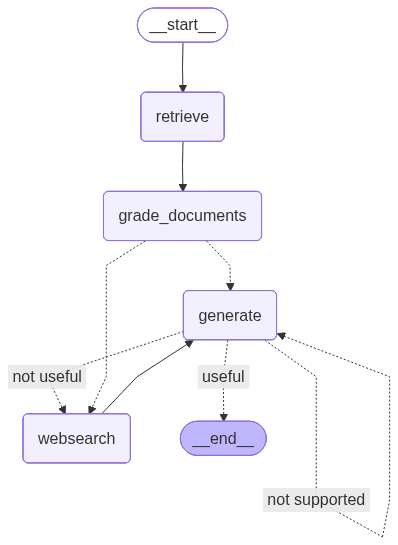

# KnowledgeSavvy 🧠


**Production-ready RAG system with multi-stage validation and hallucination detection**

> Transform your documents into an intelligent knowledge base with advanced AI-powered retrieval and answer validation

---

## 🎯 Why KnowledgeSavvy?

Traditional RAG systems retrieve documents and generate answers blindly. **KnowledgeSavvy goes beyond** with:

- ✅ **Multi-stage validation** that verifies each answer is grounded in your documents
- ✅ **Hallucination detection** to prevent AI from making up information
- ✅ **Intelligent grading** that assesses document relevance and answer quality
- ✅ **Automatic web search** fallback when documents don't contain the answer
- ✅ **Production-ready architecture** with comprehensive testing and error handling

## RAG Pipeline Architecture

<p align="center">
  
</p>

### What Makes This RAG Different?

```
Traditional RAG:  Question → Retrieve → Generate → Answer
                  ❌ No validation, hallucinations possible

KnowledgeSavvy:   Question → Retrieve → Grade Documents → 
                  Generate → Validate Answer → Check Quality →
                  Web Search (if needed) → Verified Answer ✅
```

## 🚀 Key Features

### 🧩 Modularity & Extensibility
- **Pluggable vector stores**: Switch Chroma, Pinecone, or pgvector via `VECTOR_STORE_BACKEND` and the factory in `core/vector_store`.
- **Pluggable models**: Choose LLMs/embeddings in `ai_models/config.py`; factories make it easy to add new providers.
- **Swappable components**: Clear interfaces for loaders, stores, and models keep changes localized.

### 💸 Cost & Reproducibility
- Chosen LLMs (Gemini, Cohere) offer free tiers so anyone can run the project without paid credits.
- The abstractions let you upgrade to stronger paid models later with minimal changes to config/factories.

### 🔍 Intelligent Document Processing
- **Multi-format support**: PDF, TXT, DOCX, MD, CSV, and web scraping
- **Smart chunking**: Configurable size and overlap for optimal retrieval
- **Collection management**: Organize documents by topic or project

### 🤖 Advanced AI Pipeline
- **LangGraph orchestration**: State-based workflow with conditional routing
- **3-stage validation**: Document relevance → Hallucination check → Answer quality
- **Hybrid AI models**: Google Gemini for validation, Cohere for generation
- **Adaptive routing**: Automatic web search when local documents are insufficient

### 📊 Multiple Vector Store Backends already implemented
- **Chroma**: Fast local development
- **Pinecone**: Scalable cloud solution
- **pgvector**: PostgreSQL integration for unified storage
- **Factory pattern**: Switch backends with a single configuration change

### 🎨 User-Friendly Interface
- **Streamlit web app**: Clean, intuitive interface
- **Real-time processing**: Upload and query documents instantly
- **Source transparency**: See which documents support each answer
- **Dashboard analytics**: Track document counts, chunks, and usage

## 🛠️ Technology Stack

| Layer | Technologies |
|-------|-------------|
| **AI Framework** | LangChain, LangGraph (workflow orchestration) |
| **AI Models** | Google Gemini 2.0 Flash, Cohere Command/Embed |
| **Vector Stores** | Chroma, Pinecone, PostgreSQL pgvector |
| **Web Framework** | Streamlit |
| **Database** | PostgreSQL + SQLAlchemy (with custom decorators) |
| **Document Processing** | Unstructured, PyPDF, LangChain loaders |
| **Web Search** | Tavily API |
| **Testing** | pytest (28 tests, 90%+ coverage) |

## ⚡ Quick Start

### Prerequisites

- Python 3.13+
- PostgreSQL with pgvector extension
- Docker and Docker Compose (recommended)

### Installation (5 minutes)

```bash
# 1. Clone the repository
git clone https://github.com/leandrodevai/KnowledgeSavvy.git
cd KnowledgeSavvy

# 2. Install dependencies
pip install pipenv
pipenv install

# 3. Set up environment variables
cp .env.example .env
# Edit .env with your API keys (Google, Cohere, Tavily)

# 4. Start PostgreSQL with pgvector
docker-compose up -d postgres_kns

# 5. Run the application
pipenv shell
streamlit run app/main.py
```

🎉 Open your browser at `http://localhost:8501` and start chatting with your documents!

## 🔧 Configuration

### Environment Setup

Create a `.env` file from the template (see `.env.example`):

```bash
# Required API Keys
GOOGLE_API_KEY=your_google_api_key          # For Gemini 2.0 Flash
COHERE_API_KEY=your_cohere_api_key          # For embeddings and generation
TAVILY_API_KEY=your_tavily_api_key          # For web search

# Vector Store Configuration
VECTOR_STORE_BACKEND=chroma                 # Options: chroma, pinecone, pgvector

# PostgreSQL (for pgvector or metadata storage)
POSTGRES_USER=<your_postgres_user>
POSTGRES_PASSWORD=<your_postgres_password>
POSTGRES_SERVER=localhost:5432
POSTGRES_DB=<your_postgres_db>

# Optional: Pinecone
PINECONE_API_KEY=your_pinecone_key          # Only if using Pinecone backend

# Optional: LangSmith (tracing and observability - not required for core functionality)
LANGCHAIN_TRACING_V2=true                   # Set to true to enable LangSmith tracing
LANGCHAIN_API_KEY=your_langsmith_api_key    # Get free key at https://smith.langchain.com
LANGCHAIN_PROJECT=your_project_name         # Project name in LangSmith dashboard
```

### Model Customization

All models are configurable in `ai_models/config.py`:
- **Embedding**: Cohere Embed v3 (English)
- **Generation**: Cohere Command (temperature 0.7)
- **Grading**: Google Gemini 2.0 Flash (structured output)

## � Usage

### Workflow in 4 Steps

```
1️⃣ Create Collection → 2️⃣ Upload Documents → 3️⃣ Ask Questions → 4️⃣ Get Validated Answers
```

#### 1. Create a Collection
- Navigate to "📁 Manage Collections" in the sidebar
- Create a new collection (e.g., "technical-docs", "company-policies")
- Collections keep your knowledge bases organized

#### 2. Upload Documents
- Select "📤 Upload Documents"
- Choose your collection
- Upload files (PDF, DOCX, TXT, MD, CSV) or scrape websites
- Configure chunking parameters for optimal retrieval

#### 3. Chat with Your Documents
- Go to "💬 Chat"
- Select your collection
- Ask questions in natural language
- Review source documents and confidence scores

#### 4. Monitor & Manage
- Use "📊 Dashboard" to view statistics
- Check document counts, chunks, and processing status
- Delete documents or entire collections as needed

### Example Questions

```
❓ "What are the main security features mentioned?"
❓ "Summarize the deployment requirements"
❓ "How does the authentication system work?"
❓ "What are the API rate limits?"
```

**Pro Tip**: Enable web search for questions that may require external context!

### Score Semantics
- `relevance_score` (0–1): Assigned by the LLM grader for retrieved documents; for web results it comes from Tavily (`tavily_result["score"]`). Higher is more relevant.
- `similarity_score` (backend-specific): Returned directly by the vector store (`similarity_search_with_score`). Interpret comparatively within the same result set (cosine similarity or distance, depending on backend).

## 🧪 Testing

Comprehensive test suite ensuring code quality and reliability.

### Test Coverage

| Component | Tests | Coverage |
|-----------|-------|----------|
| **Vector Store Manager** | 11 tests | 95% |
| **Database CRUD** | 10 tests | 92% |
| **Configuration** | 7 tests | 88% |
| **Total** | **28 tests** | **90%+** |

### Run Tests

```bash
pipenv shell

# All unit tests (fast, uses SQLite in-memory)
python -m pytest tests/ -m unit -v

# Specific component
python -m pytest tests/test_vs_manager.py -v

# With coverage report
python -m pytest --cov=. --cov-report=html
```

📋 **All tests passing** | ⚡ **Fast execution** (< 5 seconds) | 🔧 **No external dependencies**

See [docs/TESTING.md](docs/TESTING.md) for detailed testing documentation.

## 📚 Documentation

Comprehensive documentation for users and developers:

| Document | Description |
|----------|-------------|
| **[📑 Documentation Index](docs/README.md)** | Overview with project statistics |
| **[👤 User Guide](docs/USER_GUIDE.md)** | Step-by-step usage instructions |
| **[💻 Developer Guide](docs/DEVELOPER_GUIDE.md)** | Code structure and module reference |
| **[🏗️ Architecture](docs/ARCHITECTURE.md)** | System design, modularity, and patterns |
| **[🧪 Testing Guide](docs/TESTING.md)** | Test suite and best practices |
| **[🚀 Deployment](docs/DEPLOYMENT.md)** | Installation and configuration |

##  License

This project is licensed under the MIT License - see the [LICENSE](LICENSE) file for details.

## 🤝 Support

**Questions or issues?**
- 🐛 [Create an issue](https://github.com/leandrodevai/KnowledgeSavvy/issues)
- 📖 Check the [documentation](docs/README.md)
- 💬 Review code examples in the codebase

## 👥 Contributing

Contributions are welcome! Please:

1. Fork the repository
2. Create a feature branch (`git checkout -b feature/amazing-feature`)
3. Make your changes with tests
4. Run the test suite (`python -m pytest tests/ -m unit -v`)
5. Submit a pull request

---

<p align="center">
  <strong>Built with ❤️ using Python, LangChain, and LangGraph</strong>
</p>

<p align="center">
  <sub>If this project helped you, please consider giving it a ⭐</sub>
</p>

## 🎯 What This Project Demonstrates

### Technical Excellence

| Skill Area | Implementation |
|------------|----------------|
| **AI/ML Engineering** | Multi-stage RAG pipeline with LangGraph orchestration |
| **Software Architecture** | Factory pattern, dependency injection, decorator pattern |
| **Testing & QA** | 28 unit tests, 90%+ coverage, pytest fixtures and markers |
| **Database Design** | PostgreSQL + pgvector, SQLAlchemy ORM, custom decorators |
| **API Integration** | Google Gemini, Cohere, Tavily, Pinecone |
| **Code Quality** | Type hints, comprehensive error handling, structured logging |
| **Documentation** | User guides, developer docs, architecture documentation |

### Key Achievements

✅ **Production-Ready Architecture** - Clean separation of concerns, extensible design  
✅ **Multi-Backend Support** - Switch between Chroma, Pinecone, or pgvector seamlessly  
✅ **Intelligent Validation** - Novel 3-stage answer verification pipeline  
✅ **Test Coverage** - Comprehensive test suite with fast execution  
✅ **Professional Standards** - PEP 8 compliance, type hints, detailed logging  

### Perfect For

- 🎓 **Learning Advanced RAG**: Go beyond basic retrieval with multi-stage validation
- 🔧 **Production Reference**: See best practices for RAG system implementation
- 📖 **Educational Use**: Well-documented codebase with clear structure

---

## 🌟 Why This RAG Implementation Stands Out

Most RAG tutorials show basic retrieval + generation. **KnowledgeSavvy implements**:

1. **State-based workflow** (LangGraph) - not just linear chains
2. **Document relevance grading** - filters irrelevant matches
3. **Hallucination detection** - verifies answers are grounded in documents
4. **Answer quality assessment** - ensures questions are actually answered
5. **Adaptive routing** - falls back to web search when needed
6. **Multiple vector stores** - production-grade abstraction layer
7. **Flexible LLM models/providers** - easily switch generation and grading models via config

---
